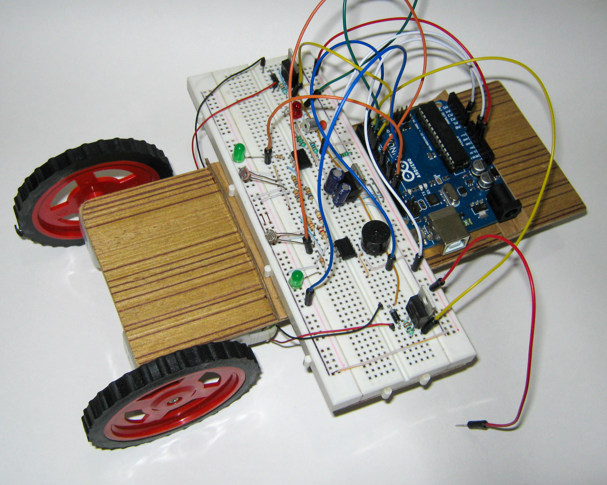
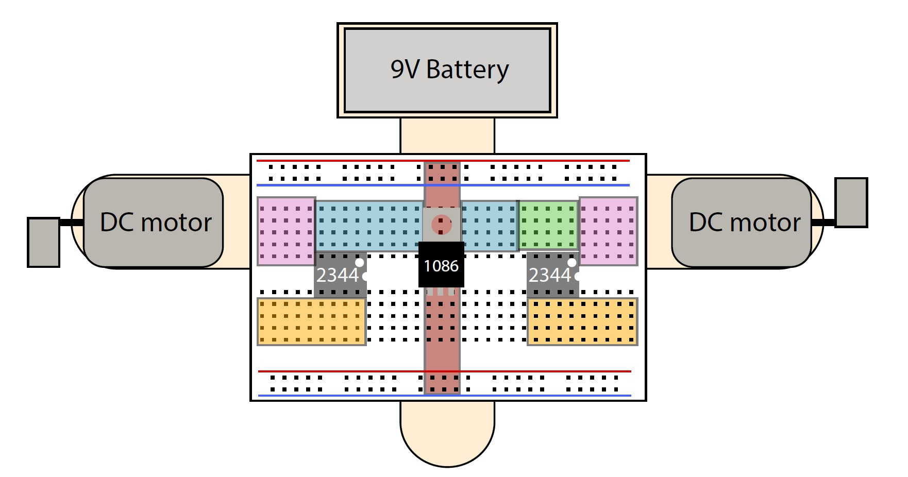

# Light and sound responsive line following robot

---

In this course, I learned all the various ways to interface various sensors to measure and sense real world data and manipulate them acoordingly. 
Understanding the fundamentals for engineering electronic interfaces between the physical world and digital devices.
Developing an understanding of the building blocks of electronics.
Analyze, design, and build different parts of a robot from scratch.

---

### Various Module and their Parts

1. **Module 1. Power Supply**
<ul>
  <li>Voltage Regulator</li>
  <li>10 μf capacitors</li>
</ul>

2. **Module 2. Light Sensor**
<ul>
  <li>Photocells + Comparators</li>
  <li>2.7 KΩ resistors</li>
  <li>LM358</li>
  <li>LEDs</li>
  <li>300 Ω current-limiting resistors</li>
</ul>

3. **Module 3. Buzzer Driver**
<ul>
<li>LM358</li>
<li>speaker</li>
  </ul>

4. **Module 4. Microphone Amplifier**
 <ul>
<li>Electret mic</li>
<li>10 kOhm resistors</li>
<li>2.7 kΩ resistor</li>
<li>100 kΩ resistor</li>
<li>1 μF cap</li>
<li>LM358</li>
  </ul>

5. **Module 5. Motor Drivers**
 <ul>
 <li>DC motors</li>
<li>IN4001 diodes</li>
<li>steel nuts</li>
<li>PN2222 NPN transistors</li>
<li>1 kΩ resistors</li>
  </ul>

---

    //***************************************************************************************
    //  Description; Final code that runs the robot
    //  Saurav Haldar
    //  March  23, 2015
    //***************************************************************************************

    int PBLOCK = 11;  // set PBLOCK as P1.1 alias
    int BUZZER = 2;   // set BUZZER as P1.3 alias
    int LMOTOR = 3;   // set LMOTOR as P2.1 alias
    int RMOTOR = 5;   // set RMOTOR as P1.6 alias
    int LPHOTO = 8;  // set LPHOTO as P1.2 alias
    int RPHOTO = 13;  // set RPHOTO as P1.7 alias
    int MICINP = A0;  // set MICINP as A5   alias
    int LED3   = 4;   // MicroPhone led 

    int MPOW   = 230;   // set motors to use 50% PWM (possible values 0-255)
    int MICTHRESH = 20; // set microphone trigger threshold (possible values 0-1023)

    int i;
    int val;
    int maxval;

    void setup()
    {  

      // set outputs
      pinMode(LMOTOR, OUTPUT);
      pinMode(RMOTOR, OUTPUT);
      pinMode(BUZZER, OUTPUT);
      pinMode(PBLOCK, OUTPUT);

      // set inputs
      pinMode(LPHOTO, INPUT);
      pinMode(RPHOTO, INPUT);

    }

    void loop()
    {
      analogWrite(LMOTOR,0);        // turn off both motors 
      analogWrite(RMOTOR,0);

      // Step 1: beep a bunch of times!
      for (i=1; i<5; i++)
      {
        beep(BUZZER, 1000, 100*i);
        delay(100*i);
      }

      // Step 2: listen to the microphone for ~100 ms
      maxval = 0;
      for (i=1; i<100; i++)
      {
        val = analogRead(MICINP);
        if (val >= 20)            // if digitized value is above 560,
        digitalWrite(LED3, HIGH); // turn on the LED...
        else
        digitalWrite(LED3, LOW); 
        if (val > maxval)
          maxval = val;
        delay(1);
      }

      // If the largest voltage detected is above 1.94 V (3.3*600/1023),
      // commence the "beep dance" response
      if (maxval > MICTHRESH)
      {
        // Make the "siren" noise by alternating 1200 Hz and 800 Hz tones
        for (i=0; i<5; i++)
        {
            beep(BUZZER, 1200, 100);
            beep(BUZZER, 800,  100);
        }
        // Shake motors back and forth rapidly
        for (i=0; i<3; i++)
        {
            analogWrite(RMOTOR, MPOW);
            delay(200);
            analogWrite(RMOTOR, 0);
            analogWrite(LMOTOR, MPOW);
            delay(200);
            analogWrite(LMOTOR, 0);
        }
        // Make a series of tones with increasing frequency from 300-100 Hz
        // then come back down
        for (i=30; i<100; i+=1)
          beep(BUZZER, 10*i, 10);
        for (i=100; i>30; i-=1)
          beep(BUZZER, 10*i, 10);
      } 
      // Step 3: read the status of photocells and adjust motor output
      digitalWrite(PBLOCK, HIGH);      // supply 3.3V to the power rail
      delayMicroseconds(20);           // delay briefly to allow comparator outputs to settle

      if (digitalRead(LPHOTO)==HIGH)         // check each photocell/circuit output and determine
          analogWrite(LMOTOR, MPOW);

      if (digitalRead(RPHOTO)==HIGH)  
           analogWrite(RMOTOR, MPOW);

        digitalWrite(PBLOCK, LOW);       // turn the power-blocked rail off
        delay(500);                      // wait 500 ms

     }

    void beep(int pin, int freq, long ms)    //generate a square wave at a given frequency for ms miliseconds
    {
      int k;
            long semiper = (long) (1000000/(freq*2));
            long loops = (long)((ms*1000)/(semiper*2));
      for (k=0;k<loops;k++)
      {
                digitalWrite(pin, HIGH);  //set buzzer pin high
          delayMicroseconds(semiper);  //for half of the period
          digitalWrite(pin, LOW);   //set buzzer pin low
                delayMicroseconds(semiper);  //for the other half of the period
      }
    }

---
